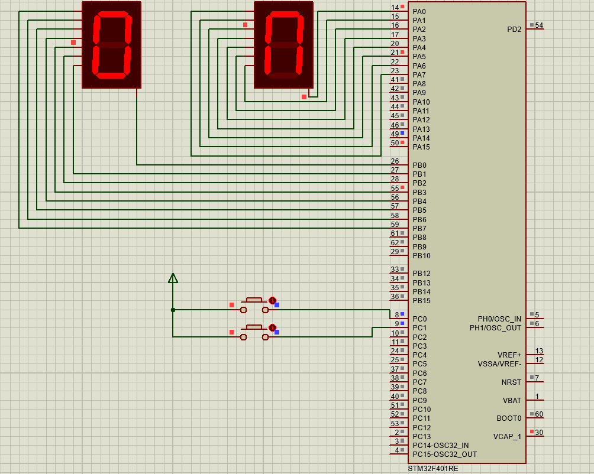

# 7-Segment Counter with STM32F401RE

## Overview
This project implements a 7-segment counter on an STM32F401RE microcontroller. The counter displays numbers from 0 to 99 and allows incrementing, decrementing, and resetting through push buttons. The implementation is done using CMSIS (not HAL) and is simulated in Proteus.

## Hardware Setup
- **Microcontroller:** STM32F401RE
- **7-Segment Displays:** Two common anode 7-segment displays
- **Push Buttons:** Two buttons for incrementing and decrementing/resetting
- **GPIO Connections:**
  - **7-Segment Display 1 (Ones Place):** Connected to `PA0-PA7`
  - **7-Segment Display 2 (Tens Place):** Connected to `PB0-PB7`
  - **Push Button 1 (Increment):** Connected to `PC0`
  - **Push Button 2 (Decrement/Reset):** Connected to `PC1`

## Code Explanation
- **GPIO Configuration:**
  - GPIOA and GPIOB are configured as output for the 7-segment displays.
  - GPIOC is configured with pull-up resistors for the push buttons.
  
- **7-Segment Mapping:**
  - A lookup table (`digit_map`) defines the segment activation for digits `0-9`.

- **Main Functionality:**
  - The program continuously checks button states.
  - If **Button 1 (PC0)** is pressed:
    - If held for less than 3 seconds, it increments the counter.
    - If held for more than 3 seconds, the counter enters a waiting state.
  - If **Button 2 (PC1)** is pressed:
    - If held for less than 3 seconds, it decrements the counter.
    - If held for more than 3 seconds, it resets the counter to `0`.

- **Counter Display Update:**
  - The counter value is split into tens and ones digits.
  - The corresponding segment patterns are loaded into GPIOA and GPIOB.
  - A delay is added to debounce button presses.

## Simulation in Proteus
To simulate the project in Proteus:
1. Add the STM32F401RE microcontroller.
2. Connect the 7-segment displays and buttons as per the hardware setup.
3. Load the compiled binary into the microcontroller.
4. Run the simulation and test increment, decrement, and reset functionality.

## How to Build and Flash
1. Compile the code using **Keil uVision**.
2. Flash the `.hex` file to the STM32F401RE using **ST-Link Utility**.
3. Run the program on real hardware or Proteus.

---

